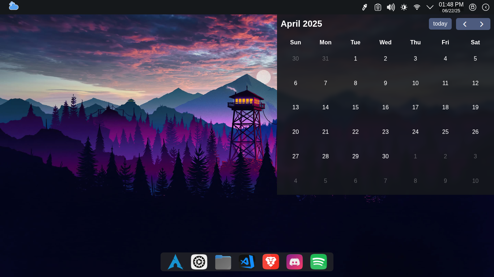
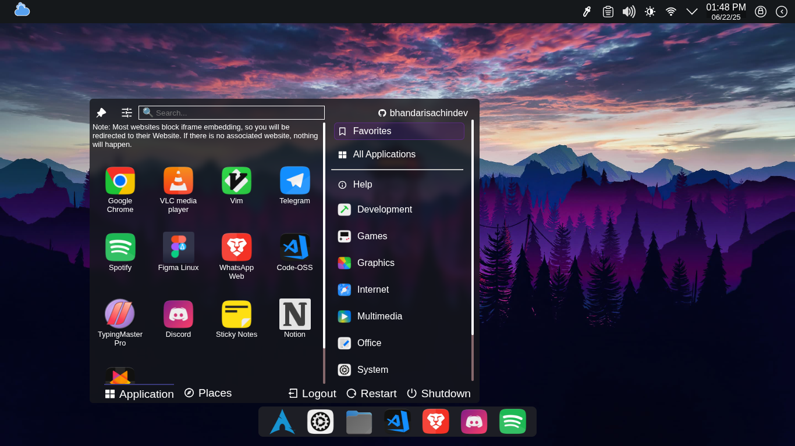
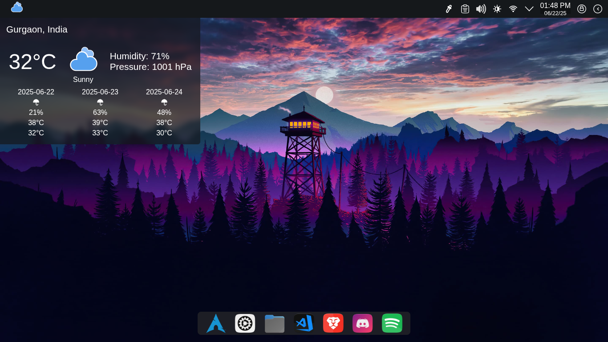
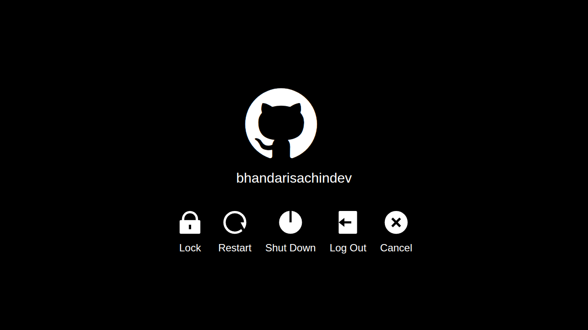

# Web-Based Desktop UI 🌐🖥️

A lightweight, modular, and interactive web-based desktop environment built with HTML, CSS, and JavaScript.

## 🚀 Live Demo

🔗 [os-eight-psi.vercel.app](https://os-eight-psi.vercel.app/)

## ✨ Features (First Draft)

- 🖼️ **Right-click to change wallpaper**
- 📅 **Interactive Calendar** (powered by [FullCalendar](https://fullcalendar.io/))
- 🌤️ **Live Weather Widget** (auto-detects your location using Geolocation API)
- 🕒 **Real-Time Clock & Date Display**
- 🧩 **App Drawer UI** (Favorites, Categories, System Actions)

> UI components like volume, brightness, logout, and dock applications are visually functional and will be made interactive in upcoming releases.

## 🖼️ Project Preview

  
  
  
  

## 🛠️ Tech Stack

- **HTML** & **CSS** (modular + custom styles)
- **JavaScript (ES6 modules)**
- **[FullCalendar.js](https://fullcalendar.io/)**
- **OpenWeather API** for weather data
- **Geolocation API** for auto-location
- **Remixicon** & custom SVG assets
